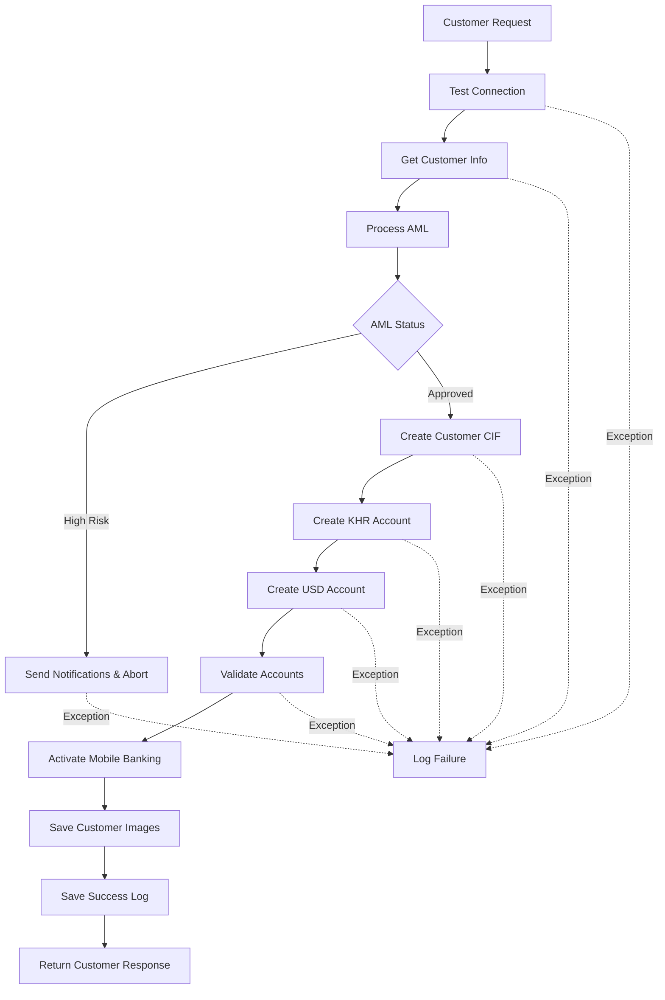

# Open Account Online Flow Documentation

## Overview

The Open Account Online service provides a comprehensive, transactional flow for creating new customer accounts with integrated AML (Anti-Money Laundering) screening, T24 banking system integration, and mobile banking activation.

**Service Implementation:** [`OpenAccountServiceImpl.java`](file:///c:/Users/makkara.nob/Desktop/NEW%20PROJECT/account_online_backend/src/main/java/com/internal/feature/open_account/service/impl/OpenAccountServiceImpl.java)

---

## Architecture Overview



---

## Process Flow

### 1. Test Connection
**Step:** `TEST_CONNECTION`  
**Purpose:** Verify database connectivity before processing

- Executes a simple database query (`SELECT 1`)
- Throws user-friendly error if connection fails
- Provides support contact information in error message

### 2. Get Customer Info
**Step:** `GET_CUSTOMER_INFO`  
**Purpose:** Retrieve existing customer information if available

- Queries existing customer data by Legal ID
- Returns customer info map containing:
  - `CIF` (Customer Information File number)
  - Existing account information (KHR/USD)
- Returns `null` if customer doesn't exist

### 3. Process AML (Anti-Money Laundering)
**Step:** `PROCESS_AML`  
**Purpose:** Screen customer against AML watchlists and risk databases

#### 3.1 Check for Existing AML Record
- Searches for existing AML status by Legal ID
- If found, validates status:
  - `APPROVE` → Continue processing
  - `PENDING` → Abort with review message
  - `REJECT` → Abort with rejection message
  - Unknown status → Abort with error

#### 3.2 Call AML Middleware (New Customer)
- Builds AML request DTO from customer data
- Calls external AML middleware service
- Receives risk assessment response

#### 3.3 Determine AML Status
- `HIGH` risk level → Status: `PENDING`
- `LOW` risk levels → Status: `APPROVE`

#### 3.4 Handle High-Risk Customers
For high-risk customers:
1. Create AML status record in database
2. Send Telegram notification
3. Send email notification
4. Throw exception to abort account creation

> [!WARNING]
> High-risk customers cannot proceed with automated account opening. Manual review is required.

---

### 4. Create Customer (CIF)
**Step:** `CREATE_CUSTOMER`  
**Purpose:** Create or retrieve Customer Information File

#### Production Mode:
- Check if customer already exists (has CIF)
- If exists → Use existing CIF
- If not exists → Create new customer in T24
- Extract CIF from T24 response
- Extract Mnemonic (short name identifier)

#### Test Mode (`skipCheckCif` enabled):
- Always creates new customer
- Bypasses existing CIF check
- Useful for testing scenarios

---

### 5. Create KHR Account
**Step:** `CREATE_KHR_ACCOUNT`  
**Purpose:** Create Khmer Riel currency account

#### Production Mode:
- Check if customer already has KHR account
- If exists → Skip creation (return `null`)
- If not exists → Create new KHR account in T24

#### Test Mode (`skipCheckAccount` enabled):
- Always creates new account
- Bypasses existing account check

---

### 6. Create USD Account
**Step:** `CREATE_USD_ACCOUNT`  
**Purpose:** Create US Dollar currency account

#### Production Mode:
- Check if customer already has USD account
- If exists → Skip creation (return `null`)
- If not exists → Create new USD account in T24

#### Test Mode (`skipCheckAccount` enabled):
- Always creates new account
- Bypasses existing account check

---

### 7. Validate Account Creation
**Step:** `VALIDATE_ACCOUNT_CREATION`  
**Purpose:** Ensure at least one account exists

Validates that the customer has at least one account (either KHR or USD):
- Checks newly created KHR account
- Checks newly created USD account
- Checks existing KHR account (from customer info)
- Checks existing USD account (from customer info)

> [!CAUTION]
> If no accounts exist after this step, the entire process fails with `FAIL_CREATE_ANY_ACCOUNT` exception.

---

### 8. Activate Mobile Banking
**Step:** `ACTIVATE_MOBILE_BANKING`  
**Purpose:** Enable mobile banking access for the customer

- Calls mobile banking service with:
  - Customer request data
  - CIF
  - KHR account number (if exists)
  - USD account number (if exists)

> [!NOTE]
> This is a **non-critical** step. Failure is logged as a warning but doesn't abort the process.

---

### 9. Save Customer Images
**Step:** `SAVE_CUSTOMER_IMAGES`  
**Purpose:** Store customer identification images

Saves two types of images:
- **NID Image** (National ID card photo)
- **Selfie Image** (Customer selfie for verification)

> [!NOTE]
> This is a **non-critical** step. Image save failures are logged but don't abort the process.

---

### 10. Save Final Success Log
**Step:** `SAVE_FINAL_LOG`  
**Purpose:** Record successful account opening

Persists comprehensive account opening record including:
- Customer request details
- Account information (CIF, accounts, mnemonic)
- AML status data
- Image paths

> [!NOTE]
> This is a **non-critical** step. Logging failures don't affect the customer experience.

---

### 11. Report Log
**Step:** `REPORT_LOG`  
**Purpose:** Create status report entry

- Logs status as `SUCCESS`
- Records Legal ID
- Message: "Open account online Successfully"

---

### 12. Return Response
**Purpose:** Provide account information to caller

Returns `CustomerResponse` containing:
- `cif` - Customer Information File number
- `khrAccount` - KHR account number (if created)
- `usdAccount` - USD account number (if created)
- `mnemonic` - Short name identifier

---

## Error Handling

### Transactional Rollback
The entire process is wrapped in `@Transactional`, ensuring:
- Database changes are rolled back on failure
- Data consistency is maintained
- No partial account creations

### Failure Logging

When any step fails:

1. **Log Error Details:**
   - Failed step name
   - Customer Legal ID
   - Error message
   - CIF (if created)
   - Account numbers (if created)

2. **Build Failure Remark:**
   - Failed step identifier
   - AML status (if not APPROVE)
   - CIF (if exists)
   - KHR account (if exists)
   - USD account (if exists)

3. **Save Failure Log:**
   - AML failures → Status: `AML`
   - Other failures → Status: `FAILURE`
   - Includes exception details

4. **Re-throw Exception:**
   - Propagates to caller
   - Triggers transaction rollback

---

## AML Integration

### Risk Level Handling

| Risk Level | AML Status | Action |
|------------|------------|--------|
| `HIGH` | `PENDING` | Abort process, send notifications |
| `LOW` | `APPROVE` | Continue processing |

### High-Risk Notification Flow

When a high-risk customer is detected:

1. **Create AML Status Record**
   - Store in database with `PENDING` status
   - Include risk assessment data
   - Link to customer Legal ID

2. **Send Telegram Alert**
   - Notify compliance team
   - Include customer details
   - Include risk assessment

3. **Send Email Notification**
   - Notify compliance email address
   - Use AML template
   - Include comprehensive customer data

4. **Abort Account Creation**
   - Throw `AccountCreationException`
   - Message: "AML review required for Legal ID: {id}"
   - Transaction rolled back

---

## Dependencies

### External Services

| Service | Purpose |
|---------|---------|
| `ValidationService` | Customer validation and lookup |
| `T24Service` | Core banking system integration |
| `MobileBankingService` | Mobile banking activation |
| `AmlMiddlewareService` | AML risk assessment |
| `AmlService` | AML status persistence |
| `MailService` | Email notifications |
| `CustomerImageService` | Image storage |
| `AccountOnlineOpenFinalService` | Success logging |
| `OccupationService` | Occupation lookup |
| `OpenAccountTelegramAlertServiceImpl` | Telegram notifications |

### Mappers

| Mapper | Purpose |
|--------|---------|
| `OpenAccountAmlStatusMapper` | AML DTO transformations |
| - `buildAmlRequestDto()` | Customer → AML request |
| - `toCreateRequest()` | Response → Create AML record |
| - `fromRequestAndResponse()` | Merge customer + AML data |
| - `buildCustomerAccInfo()` | Build account info response |
| - `toDto()` | Entity → DTO conversion |

---

## Test Mode Configuration

The service supports test mode configuration via `TestProperties`:

### Skip CIF Check (`isSkipCheckCif()`)
When enabled:
- Always creates new customer
- Ignores existing CIF
- Useful for testing customer creation logic

### Skip Account Check (`isSkipCheckAccount()`)
When enabled:
- Always creates new accounts
- Ignores existing accounts
- Useful for testing account creation logic

> [!TIP]
> Test mode should only be enabled in development/staging environments.

---

## Success Criteria

An account opening is considered successful when:

✅ Database connection is healthy  
✅ Customer info is retrieved (or confirmed as new)  
✅ AML screening is passed (not HIGH risk)  
✅ Customer CIF is created or retrieved  
✅ At least one account (KHR or USD) exists  
✅ Success log is persisted  

> [!IMPORTANT]
> Mobile banking activation and image saves are optional. Failures in these steps don't prevent success.

---

## API Contract

### Request: `CustomerRequest`

```
{
  "legalId": "string",                // National ID
  "givenName": "string",              // First name (English)
  "familyName": "string",             // Last name (English)
  "firstNameKh": "string",            // First name (Khmer)
  "lastNameKh": "string",             // Last name (Khmer)
  "dateOfBirth": "YYYY-MM-DD",        // Date of birth
  "gender": "string",                 // Gender
  "placeOfBirth": "string",           // Place of birth
  "companyName": "string",            // Company name
  "referralId": "string",             // Referral staff code
  "branchCode": "string",             // Branch code
  "occupation": "string",             // Occupation code
  "maritalStatus": "string",          // Marital status
  "customerCurrentProvince": "string",// Current province
  "customerCurrentDistrict": "string",// Current district
  "customerCurrentCommune": "string", // Current commune
  "customerCurrentVillage": "string", // Current village
  "customerPobProvince": "string",    // Place of birth province
  "customerPobDistrict": "string",    // Place of birth district
  "customerPobCommune": "string",     // Place of birth commune
  "customerPobVillage": "string",     // Place of birth village
  "legalIssueDate": "YYYY-MM-DD",     // Legal document issued date
  "legalExpireDate": "YYYY-MM-DD",    // Legal document expiry date
  "legalAddress": "string",           // Legal address
  "legalDocType": "string",           // Legal document type
  "legalMrz1": "string",              // MRZ line 1
  "legalMrz2": "string",              // MRZ line 2
  "legalMrz3": "string",              // MRZ line 3
  "phoneNumber": "string",            // Contact number
  "nidImage": "string",               // Base64 encoded NID image
  "selfieImage": "string"             // Base64 encoded selfie
}

```

### Response: `CustomerResponse`

```
{
  "cif": "string",               // Customer Information File
  "khrAccount": "string",        // KHR account number
  "usdAccount": "string",        // USD account number
  "mnemonic": "string"           // Short name identifier
}
```

### Exceptions

| Exception | Scenario |
|-----------|----------|
| `AccountCreationException` | AML high-risk, validation failure, no accounts created |
| `RuntimeException` | Database connection failure |
| Generic `Exception` | T24 integration errors, unexpected failures |

---

## Logging

The service provides comprehensive logging at each step:

### INFO Logs
- Process start/completion
- Step entry/success messages
- Customer identifiers
- Account numbers created
- AML risk levels

### WARN Logs
- Non-critical failures (mobile banking, images, logging)
- Test mode enabled messages

### ERROR Logs
- Critical failures
- Failed step identification
- Exception details
- Partial creation state

---

## Performance Considerations

### Critical Path
Steps that must succeed:
- Connection test
- Customer info retrieval
- AML processing
- Customer creation
- Account creation
- Account validation

**Estimated time:** 3-8 seconds (depending on T24 response time)

### Non-Critical Path
Steps that can fail gracefully:
- Mobile banking activation
- Image storage
- Success logging

**Impact:** No delay if these fail

---

## Security Considerations

> [!CAUTION]
> **Sensitive Data Handling**
> - Legal IDs are logged and persisted
> - Customer images are stored
> - Ensure proper data protection compliance

> [!WARNING]
> **AML Compliance**
> - High-risk customers cannot open accounts automatically
> - Manual review is mandatory for high-risk cases
> - Audit trail is maintained for all AML decisions

---

## Maintenance Notes

### Common Failure Points

1. **T24 Service Unavailability**
   - Symptom: Failures at CREATE_CUSTOMER or CREATE_*_ACCOUNT
   - Resolution: Check T24 service health

2. **AML Middleware Timeout**
   - Symptom: Failures at PROCESS_AML
   - Resolution: Check AML middleware connectivity

3. **Database Connection Issues**
   - Symptom: Failure at TEST_CONNECTION
   - Resolution: Verify database credentials and network

### Monitoring Recommendations

- Track AML high-risk rate
- Monitor step completion times
- Alert on repeated failures at specific steps
- Track mobile banking activation success rate

---

## Future Enhancements

Potential improvements:
- Async image processing
- Retry mechanism for mobile banking activation
- Batch account creation for multiple currencies
- Enhanced AML risk scoring integration
- Real-time account activation status

---

## Contact & Support

For issues or questions:
- **Support Hotline:** 070 200 002
- **Alternative:** 1800 200 888
- **Team:** Account Opening Development Team

---

**Document Version:** 1.0  
**Last Updated:** 2025-11-25  
**Service Version:** Current Production
