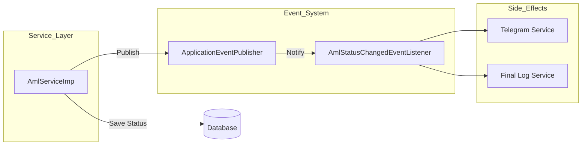

# AML System Architecture

The AML (Anti-Money Laundering) module follows the same "Pro" clean architecture principles as the `OpenAccountService`, focusing on the separation of core business logic from non-critical side effects.

## 1. Core Architecture Patterns

### A. Event-Driven Side Effects
We use an internal Pub-Sub model to handle operations that don't need to block the primary AML update.
- **Producer**: `AmlServiceImp` publishes an `AmlStatusChangedEvent`.
- **Consumer**: `AmlStatusChangedEventListener` listens for the event and executes post-processing.

### B. Single Responsibility Service
The `AmlServiceImp` is now responsible ONLY for:
- Managing AML records in the database.
- Maintaining status history trail.
- Orchestrating address resolution.

---

## 2. Interaction Diagram

---

## 3. Maintenance and Scalability
This architecture allows the AML module to grow without increasing code complexity:
- **Resilience**: If the Telegram API is down, the AML technician can still approve/reject records successfully.
- **Extensibility**: To add a new action (e.g., "Notify Compliance Manager via Email"), you simply add a new method to the `EventListener`.
