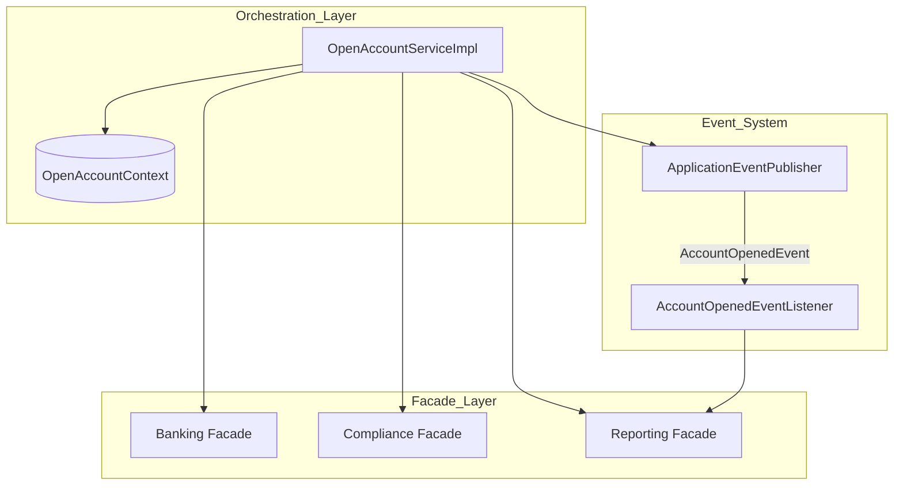

# Open Account System Architecture

This document describes the refactored architecture of the `OpenAccountService`.

## 1. High-Level Design Patterns

### A. Facade Pattern
We use **Facades** to group 13+ low-level services into three logical domains:
- **Banking**: T24, accounts, and core banking.
- **Compliance**: AML processing and risk assessment.
- **Reporting**: Logging, Telegram alerts, and image management.

### B. Process Context Pattern
The `OpenAccountContext` acts as a "Dossier" that collects all data (CIF, Account Numbers, AML results) as the customer progresses.

### C. Event-Driven Architecture
Non-critical side effects (Logging, Images, Telegram) are decoupled using Spring Events.

---

## 2. Interaction Diagram

