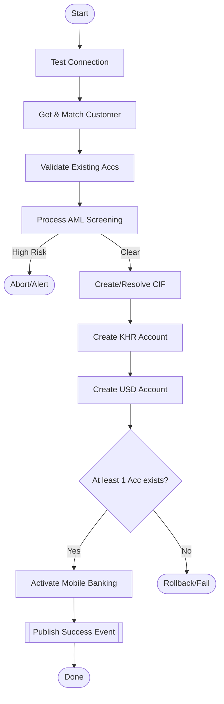

# Open Account Business Logic

The `openAccount` method orchestrates a sequential pipeline.

### Step-by-Step Logic
1.  **System Health Check**: `BankingFacade.testConnection()` ensures T24 middleware is reachable.
2.  **Identity Resolution**: `BankingFacade.getCustomerInfo(legalId)` retrieves existing customer records.
    - **Logic**: If T24 returns multiple records for one NID, the system identifies the "Primary CIF".
    - **Matching**: It compares the provided name/DOB with T24 data to ensure no identity theft.
3.  **Conflict Validation**: `BankingFacade.validateExistingAccounts(customerInfo)` checks for duplicate accounts.
    - **Rule**: If the customer already has a savings account in KHR or USD, the system may skip creation or reuse the existing one based on internal business rules.
4.  **Regulatory Clearance (AML)**: `ComplianceFacade.processAml(request)` runs the screening.
5.  **CIF Orchestration**: `BankingFacade.createCustomerIfNeeded(...)` creates or resolves a CIF in T24.
6.  **Account Provisioning**: Creates KHR and USD accounts via T24.
7.  **Final Validation**: Verifies that at least one usable account exists.
8.  **Digital Activation**: Links new accounts to the customer's mobile profile.
9.  **Post-Processing**: Publishes the Success Event for images and logs.

---

## Logical Flowchart

